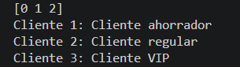
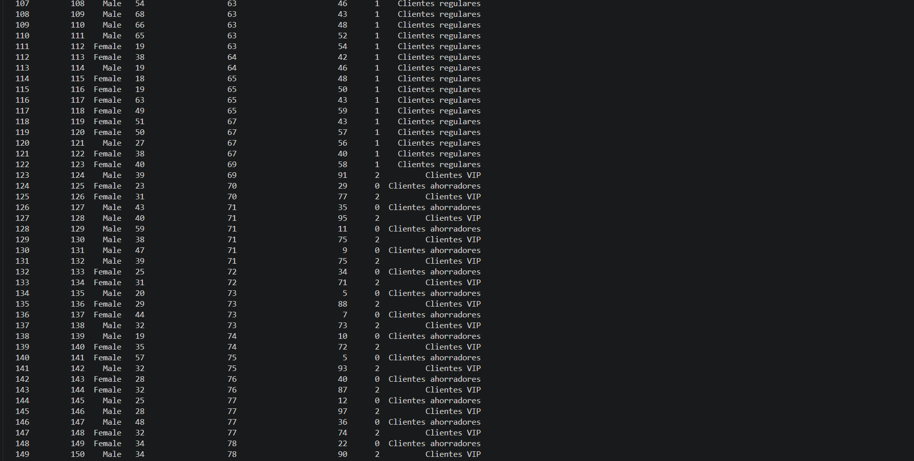
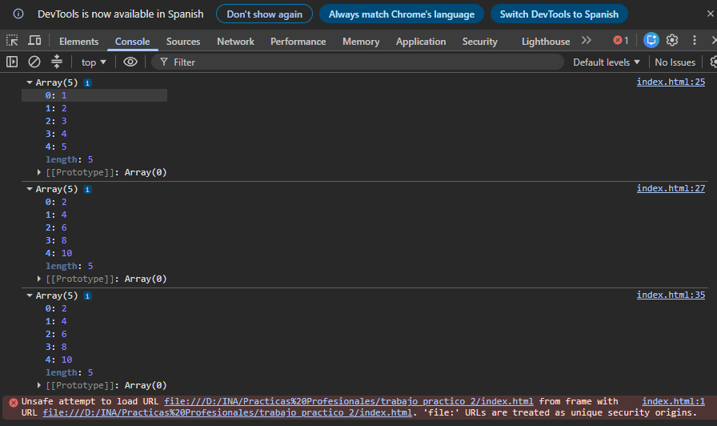

# Segmentación de Clientes con Machine Learning No Supervisado

## Descripción General
Este proyecto aplica técnicas de Machine Learning no supervisado, específicamente el algoritmo K-Means, para segmentar a los clientes de un centro comercial en tres grupos según su ingreso anual y su puntaje de gasto: clientes ahorradores, regulares y VIP. El objetivo es identificar patrones de comportamiento de compra sin contar con etiquetas previas en los datos.

Además, incluye dos ejercicios complementarios sobre el uso de la función `.map()`, uno en Python (incluyendo su aplicación con Pandas) y otro en JavaScript, como práctica de manipulación y transformación de datos.

## Tecnologías Utilizadas
- Python
- Pandas
- Scikit-learn (KMeans)
- HTML / JavaScript

## Estructura del Proyecto
- `ml_no_supervisado_clientes.py` = Script principal. Carga el dataset, entrena un modelo K-Means con 3 clusters y clasifica tanto a los clientes existentes como a nuevos clientes ingresados manualmente.
- `Mall_Customers.csv` = Dataset con información de clientes (ingreso anual, puntaje de gasto, entre otros).
- `map.py` = Ejercicio de práctica sobre la función `.map()` en Python, incluyendo su uso para mapear categorías en un DataFrame de Pandas.
- `grupos.csv` = Archivo de salida generado por `map.py`.
- `index.html` = Ejercicio equivalente sobre `.map()` en JavaScript.

## Instrucciones para Ejecutar el Código

### 1. Instalar dependencias
```bash
pip install pandas scikit-learn
```

### 2. Ejecutar el script principal (segmentación de clientes)
```bash
python ml_no_supervisado_clientes.py
```

### 3. Ejecutar el ejercicio de `.map()` en Python
```bash
python map.py
```

### 4. Ver el ejercicio de `.map()` en JavaScript
Abrir el archivo `index.html` en el navegador y revisar la consola del desarrollador (F12 → pestaña Console).

## Ejemplo de Resultados
#### Segmentación de clientes (Python)



#### Ejercicio .map() en JavaScript


## Conclusiones Personales
Esta aplicacion se puede utilizar para identificar potenciales clientes, ya sea para venderles algun tipo de producto o ofrecerle servicios.
Los clientes que ahorren mucho deben de tener algun gasto al cual se pueda apuntar el negocio o tambien los que gastan mucho pueden tener algun tipo de necesidad que no se este satisfaciendo.